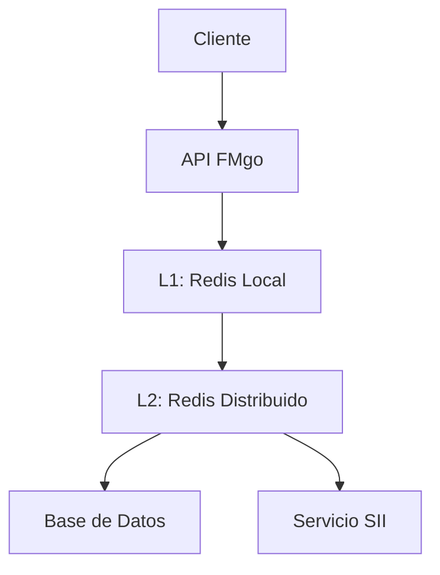
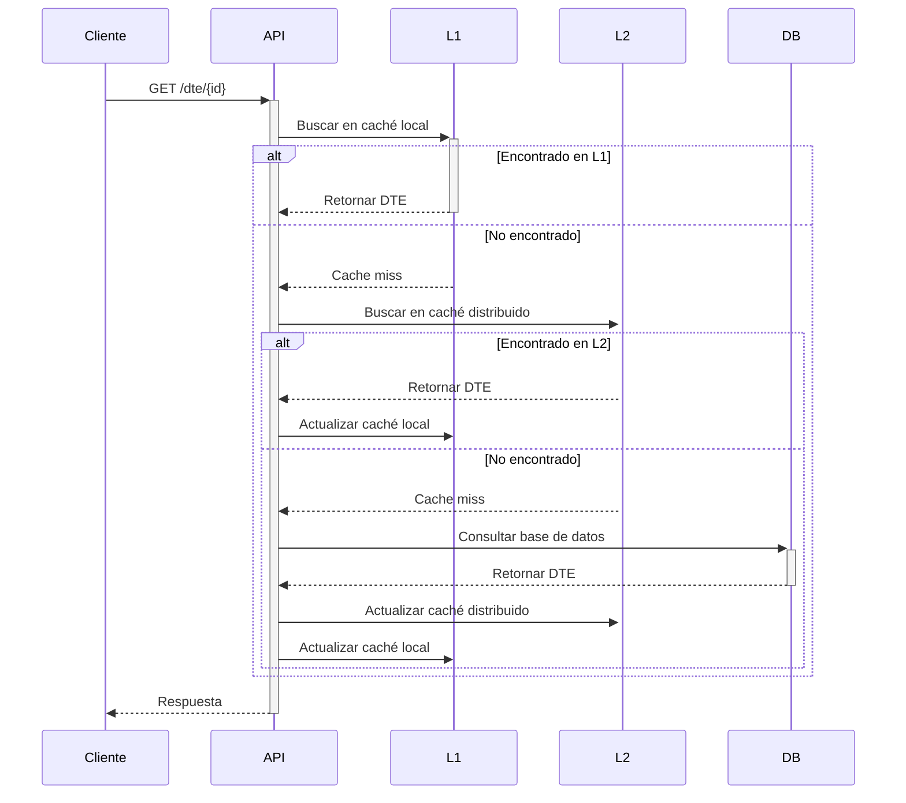
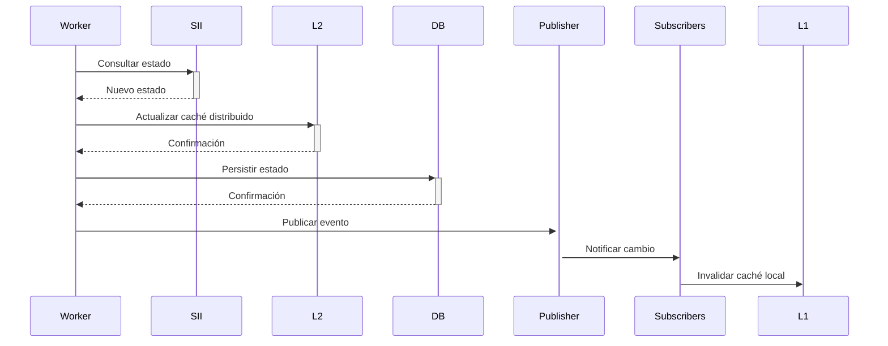

# Estrategia de Caché

## Descripción General
FMgo implementa una estrategia de caché multinivel para optimizar el rendimiento y reducir la carga en servicios externos.

## Arquitectura

### 1. Niveles de Caché


### 2. Tipos de Datos Cacheados

#### Documentos
```yaml
dte_cache:
  prefix: "dte:"
  ttl: 24h
  max_size: 2GB
  fields:
    - xml
    - estado
    - track_id
    - timestamps
```

#### Tokens
```yaml
token_cache:
  prefix: "token:"
  ttl: 1h
  max_size: 100MB
  fields:
    - token
    - expiry
    - rut
```

#### Estados
```yaml
status_cache:
  prefix: "status:"
  ttl: 12h
  max_size: 500MB
  fields:
    - estado
    - detalles
    - timestamp
```

## Políticas de Caché

### 1. Invalidación
- **Time-based**: TTL por tipo de dato
- **Event-based**: Cambios de estado
- **Manual**: API de administración

### 2. Actualización
- **Lazy Loading**: Al primer acceso
- **Write-through**: Actualización síncrona
- **Background Refresh**: Para datos críticos

### 3. Distribución
- **Particionamiento**: Por RUT emisor
- **Replicación**: Para alta disponibilidad
- **Consistencia**: Eventual

## Configuración Redis

### Local (L1)
```yaml
redis_local:
  host: localhost
  port: 6379
  db: 0
  max_memory: 1GB
  max_memory_policy: allkeys-lru
  notify_keyspace_events: "Ex"
```

### Distribuido (L2)
```yaml
redis_cluster:
  nodes:
    - host: redis-1
      port: 6379
    - host: redis-2
      port: 6379
  max_memory: 10GB
  max_memory_policy: volatile-lru
  replication: true
```

## Patrones de Uso

### 1. Lectura de DTE


### 2. Actualización de Estado


## Monitoreo

### Métricas
- Hit ratio por nivel
- Latencia de acceso
- Uso de memoria
- Tasa de evicción
- Patrones de acceso

### Alertas
1. **Críticas**:
   - Redis no disponible
   - Memoria > 90%
   - Hit ratio < 50%

2. **Advertencias**:
   - Memoria > 80%
   - Latencia > 100ms
   - Hit ratio < 70%

## Manejo de Errores

### 1. Fallos de Caché
- Fallback a siguiente nivel
- Circuit breaker para Redis
- Logs detallados

### 2. Inconsistencias
- Verificación periódica
- Reconciliación automática
- Limpieza programada

### 3. Recuperación
- Rebuild desde DB
- Warm-up progresivo
- Priorización de datos

## Herramientas de Administración

### CLI
```bash
# Estadísticas de caché
fmgo cache stats

# Limpiar caché
fmgo cache flush [tipo]

# Precarga de datos
fmgo cache warm [tipo]

# Verificar consistencia
fmgo cache verify
```

### API
```http
# Estadísticas
GET /api/v1/admin/cache/stats

# Invalidación
POST /api/v1/admin/cache/invalidate
{
  "tipo": "dte",
  "patron": "dte:76*"
}

# Precarga
POST /api/v1/admin/cache/warm
{
  "tipo": "dte",
  "fecha_inicio": "2024-01-01",
  "fecha_fin": "2024-03-15"
}
``` 