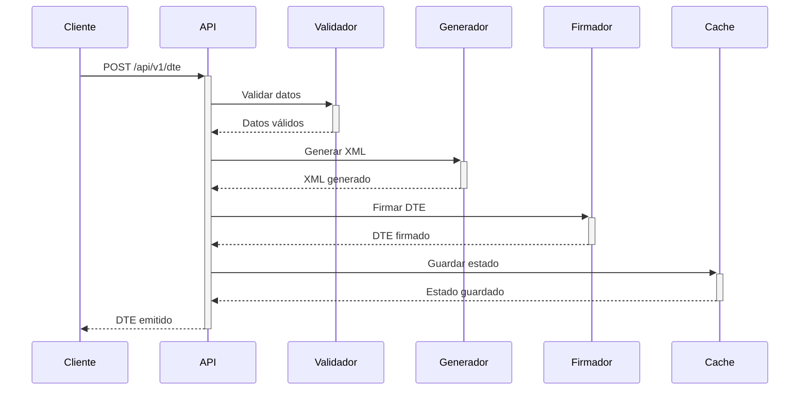
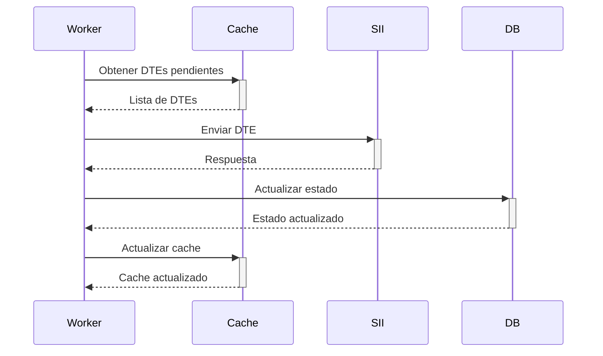

# Flujo de Documentos Tributarios Electrónicos (DTE)

## Descripción General
El flujo de DTE en FMgo maneja la emisión, validación y envío de documentos tributarios electrónicos al SII.

## Componentes Principales

### 1. Emisión de DTE


### 2. Envío al SII


## Estados del DTE
1. `PENDIENTE`: DTE generado, pendiente de envío
2. `PROCESANDO`: En proceso de envío al SII
3. `ACEPTADO`: Aceptado por el SII
4. `RECHAZADO`: Rechazado por el SII
5. `ERROR`: Error en el proceso

## Validaciones
- RUT emisor y receptor
- Estructura del documento
- Totales y cálculos
- Firma electrónica
- CAF vigente

## Caché y Persistencia
- Redis para estados y documentos recientes
- PostgreSQL para almacenamiento permanente
- TTL configurable para caché

## Métricas
- Tiempo de emisión
- Tiempo de respuesta SII
- Tasa de aceptación
- Errores por tipo

## Manejo de Errores
1. **Validación**:
   - Datos inválidos
   - CAF no disponible
   - Firma inválida

2. **Envío**:
   - Timeout SII
   - Rechazo SII
   - Error de conexión

3. **Sistema**:
   - Cache no disponible
   - DB no disponible
   - Recursos insuficientes

## Configuración
```yaml
dte:
  timeout: 30s
  retry:
    max_attempts: 3
    backoff: exponential
  cache:
    ttl: 24h
    max_size: 1GB
  validation:
    strict_mode: true
    schema_version: "1.0"
```

## API Endpoints

### Emisión
```http
POST /api/v1/dte
Content-Type: application/json
Authorization: Bearer <token>

{
  "tipo_dte": "33",
  "emisor": {
    "rut": "76123456-7",
    "razon_social": "EMPRESA SPA"
  },
  "receptor": {
    "rut": "77654321-8",
    "razon_social": "CLIENTE LTDA"
  },
  "detalles": [...]
}
```

### Consulta
```http
GET /api/v1/dte/{id}/estado
Authorization: Bearer <token>
```

### Reenvío
```http
POST /api/v1/dte/{id}/reenviar
Authorization: Bearer <token>
```

## Ejemplos de Uso
Ver `examples/dte_examples.md` para casos de uso comunes y ejemplos de código. 