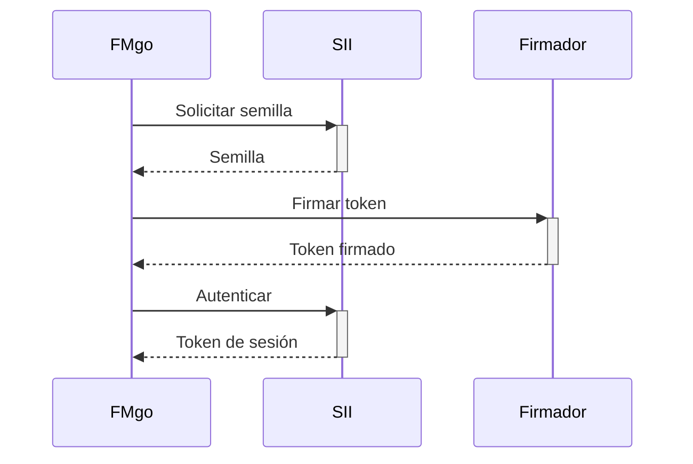
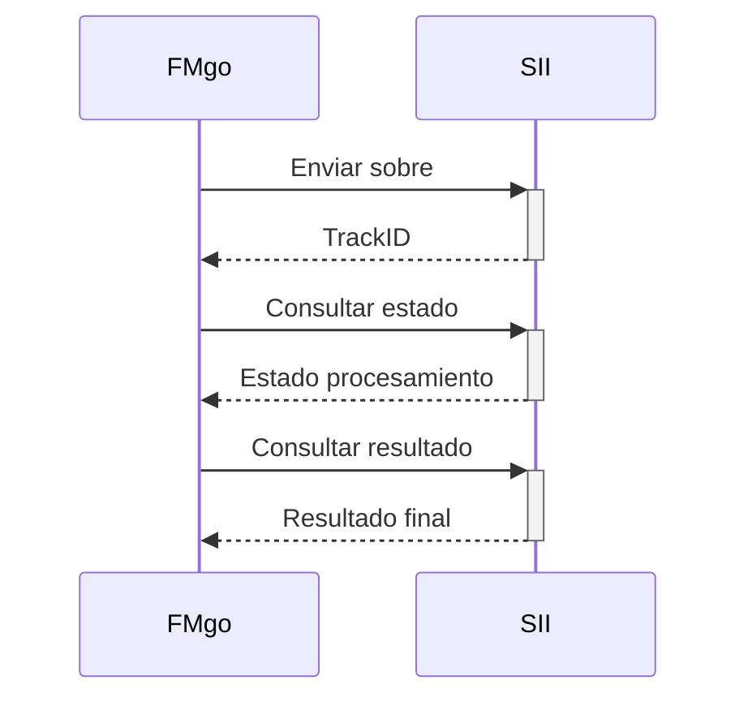

# Integración con SII

## Descripción General
La integración con el Servicio de Impuestos Internos (SII) maneja la autenticación, envío y consulta de documentos tributarios.

## Componentes Principales

### 1. Autenticación


### 2. Envío de Documentos


## Endpoints SII

### Ambiente de Certificación
- Autenticación: `https://maullin.sii.cl/DTEWS/GetTokenFromSeed.jws`
- Semilla: `https://maullin.sii.cl/DTEWS/CrSeed.jws`
- Envío DTE: `https://maullin.sii.cl/DTEWS/DTE.jws`
- Estado F29: `https://maullin.sii.cl/DTEWS/EstF29.jws`

### Ambiente de Producción
- Autenticación: `https://palena.sii.cl/DTEWS/GetTokenFromSeed.jws`
- Semilla: `https://palena.sii.cl/DTEWS/CrSeed.jws`
- Envío DTE: `https://palena.sii.cl/DTEWS/DTE.jws`
- Estado F29: `https://palena.sii.cl/DTEWS/EstF29.jws`

## Certificados y Firma

### Requerimientos
- Certificado digital vigente
- Clave privada en formato PEM
- Certificado público en formato PEM

### Proceso de Firma
1. Obtener semilla desde SII
2. Firmar semilla con certificado
3. Obtener token de sesión
4. Firmar documentos con certificado
5. Enviar documentos firmados

## Manejo de Errores

### 1. Autenticación
- Certificado expirado
- Firma inválida
- Servicio no disponible
- Token expirado

### 2. Envío
- Sobre mal formado
- Schema inválido
- Firma no corresponde
- Timeout de conexión

### 3. Consulta
- TrackID inválido
- Estado no disponible
- Error de procesamiento

## Reintentos y Circuit Breaker

```yaml
sii:
  retry:
    max_attempts: 3
    initial_delay: 1s
    max_delay: 30s
    multiplier: 2
  circuit_breaker:
    failure_threshold: 5
    reset_timeout: 60s
    half_open_requests: 3
```

## Monitoreo

### Métricas
- Tiempo de respuesta SII
- Tasa de éxito/error
- Duración de sesiones
- Documentos procesados
- Errores por tipo

### Alertas
1. **Críticas**:
   - Servicio SII caído
   - Error de certificado
   - Tasa de error > 10%

2. **Advertencias**:
   - Latencia alta
   - Certificado próximo a expirar
   - Tasa de error > 5%

## Caché

### Tokens
```yaml
token_cache:
  ttl: 1h
  refresh_before: 10m
  max_size: 100MB
```

### Estados
```yaml
status_cache:
  ttl: 24h
  refresh_interval: 5m
  max_size: 1GB
```

## Ejemplos

### Envío de DTE
```python
# Ejemplo de envío de DTE al SII
sii_client = SIIClient(cert_path, key_path)
token = sii_client.authenticate()

response = sii_client.send_dte(
    rut_emisor="76123456-7",
    tipo_envio="DTE",
    archivo="envio_dte.xml",
    token=token
)

track_id = response.track_id
```

### Consulta de Estado
```python
# Ejemplo de consulta de estado
estado = sii_client.get_estado(
    rut_emisor="76123456-7",
    track_id=track_id,
    token=token
)

if estado.is_processed():
    resultado = sii_client.get_resultado(track_id)
```

## Logs y Trazabilidad

### Formato de Log
```json
{
  "timestamp": "2024-03-15T10:30:00Z",
  "level": "INFO",
  "event": "sii_request",
  "endpoint": "/DTEWS/DTE.jws",
  "track_id": "12345678",
  "duration_ms": 234,
  "status": "success"
}
```

### Trazabilidad
- Request ID único
- Correlación con DTE
- Timestamps de cada etapa
- Estados intermedios 