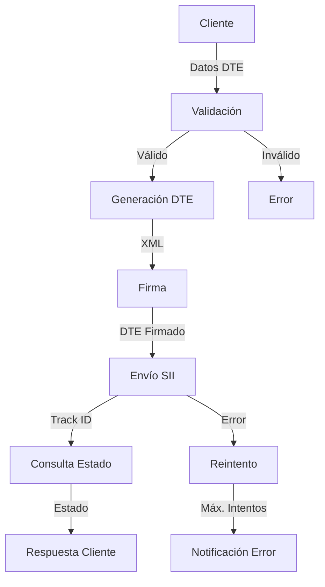
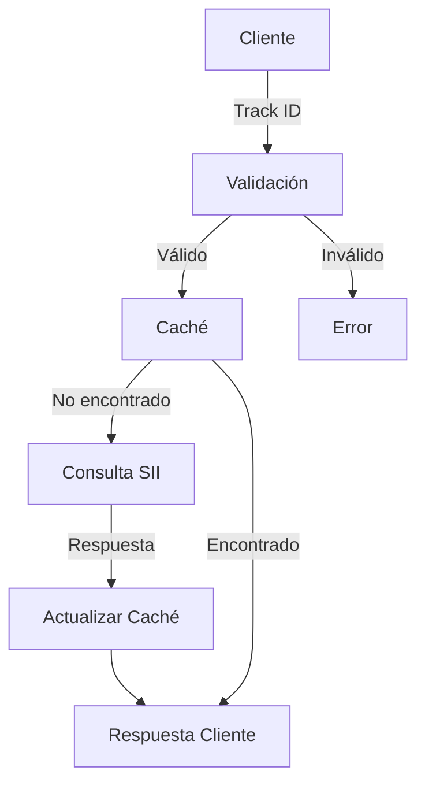
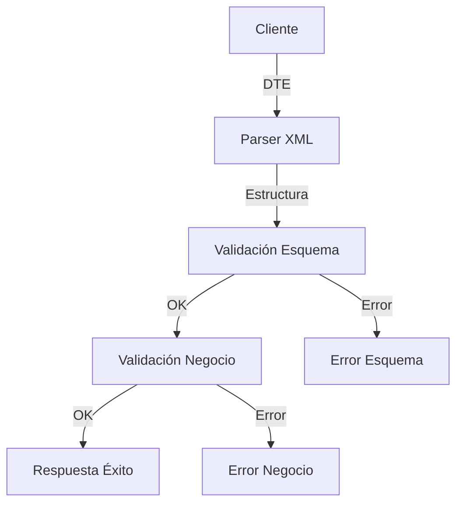

# Flujos de Negocio - FMgo MVP

## Flujos Principales

### 1. Generación y Envío de DTE

#### Estados
1. Recepción de datos
2. Validación
3. Generación
4. Firma
5. Envío
6. Seguimiento
7. Respuesta

### 2. Consulta de Estado

#### Estados
1. Recepción Track ID
2. Verificación caché
3. Consulta SII
4. Actualización
5. Respuesta

### 3. Validación de DTE

#### Validaciones
1. Estructura XML
2. Esquema XSD
3. Reglas de negocio
4. Datos obligatorios
5. Consistencia

## Manejo de Errores

### 1. Errores de Validación
- Datos incorrectos
- Esquema inválido
- Reglas de negocio
- Datos faltantes
- Inconsistencias

### 2. Errores de Comunicación
- Timeout SII
- Error de conexión
- Error de certificado
- Error de token
- Error de servicio

### 3. Errores de Sistema
- Base de datos
- Caché
- Filesystem
- Memoria
- CPU

## Reintentos y Recuperación

### 1. Política de Reintentos
- Máximo 3 intentos
- Backoff exponencial
- Timeout configurable
- Logging de intentos
- Notificación de fallos

### 2. Recuperación
- Rollback de transacciones
- Limpieza de recursos
- Notificación de errores
- Logging detallado
- Monitoreo de estado

## Monitoreo de Flujos

### 1. Métricas
- Tiempo de procesamiento
- Tasa de éxito
- Errores por tipo
- Uso de recursos
- Performance

### 2. Alertas
- Errores críticos
- Performance degradada
- Recursos agotados
- Timeouts frecuentes
- Fallos de conexión

## Optimizaciones

### 1. Caché
- Tokens SII
- Estados de documentos
- Respuestas frecuentes
- Configuraciones
- Certificados

### 2. Performance
- Procesamiento paralelo
- Batch processing
- Connection pooling
- Query optimization
- Resource management

## Documentación Pendiente

1. Detalles de implementación
2. Casos de uso específicos
3. Manejo de excepciones
4. Configuraciones avanzadas
5. Troubleshooting guide 