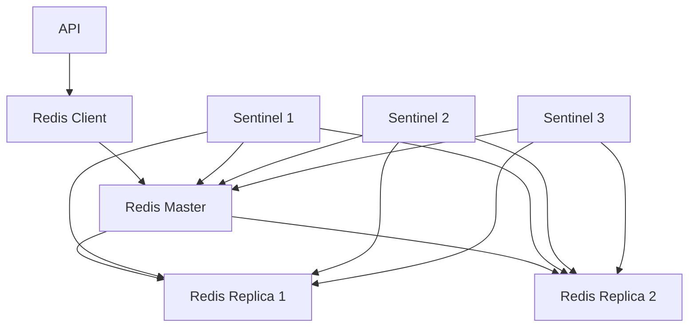
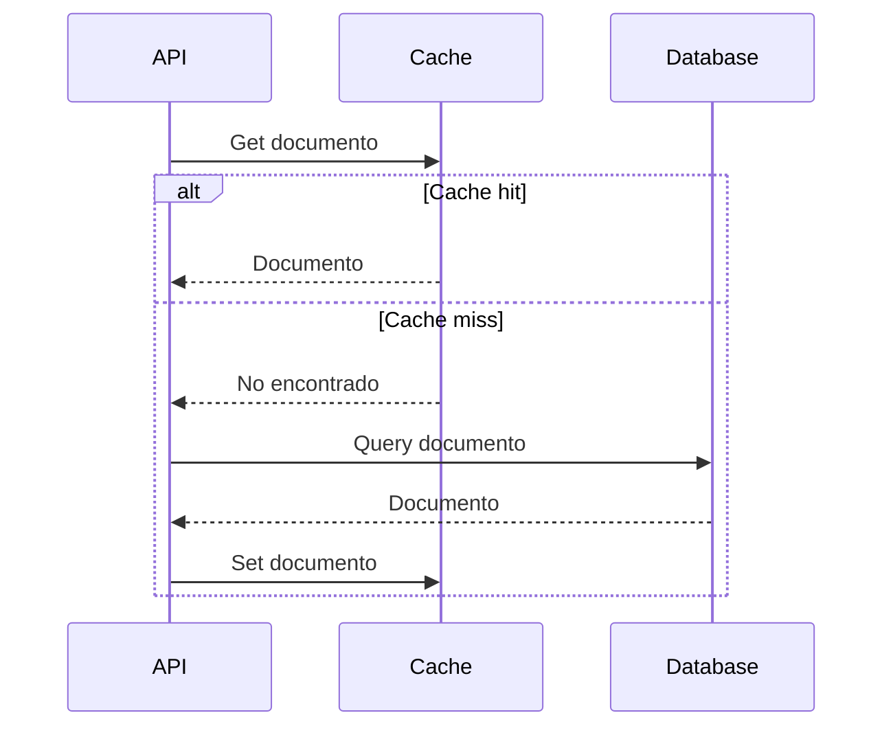
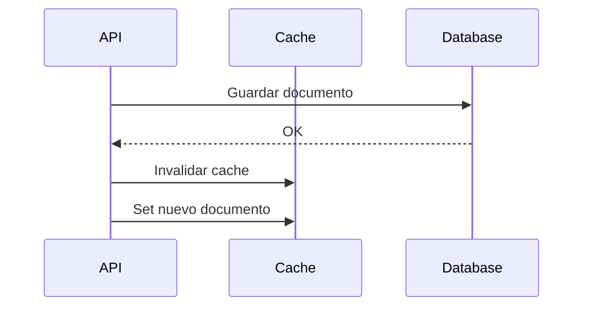
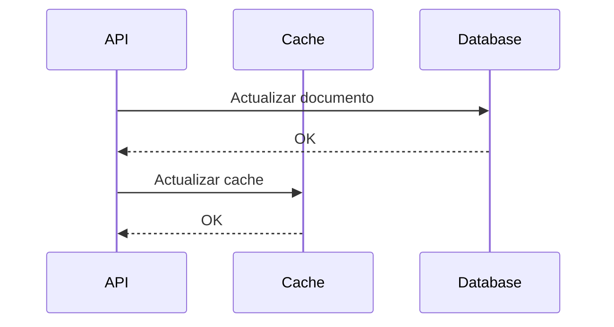

# Sistema de Caché Redis

## Descripción General
El sistema de caché Redis es un componente crítico que proporciona almacenamiento en memoria de alta velocidad para documentos, tokens y estados, mejorando significativamente el rendimiento y la escalabilidad del sistema.

## Arquitectura

### 1. Componentes


### 2. Configuración
- Modo: Master-Replica
- Persistencia: RDB + AOF
- Eviction: allkeys-lru
- Máxima memoria: 80%

## Estructuras de Datos

### 1. Documentos
```redis
# Hash para documento
HSET dte:33:1000 
    xml "<xml>...</xml>"
    estado "PENDIENTE"
    timestamp "2024-03-20T10:00:00Z"
    trackId "123456789"

# TTL: 24 horas
EXPIRE dte:33:1000 86400
```

### 2. Tokens
```redis
# String para token SII
SET token:sii:76123456-7 "ABC123..."
EXPIRE token:sii:76123456-7 3600

# Hash para metadata
HSET token:meta:76123456-7
    created_at "2024-03-20T10:00:00Z"
    expires_at "2024-03-20T11:00:00Z"
    type "SII"
```

### 3. Estados
```redis
# Sorted Set para estados
ZADD estados:dte:33:1000 
    1710936000 "PENDIENTE"
    1710936100 "XML_GENERADO"
    1710936200 "FIRMADO"
```

## Políticas de Caché

### 1. Expiración
- Documentos: 24 horas
- Tokens: 1 hora
- Estados: 48 horas
- Metadata: 72 horas

### 2. Evicción
- Política: allkeys-lru
- Umbral: 80% memoria
- Mínimo: 100MB libre

### 3. Persistencia
- RDB: cada 15 minutos
- AOF: cada segundo
- Compactación: automática

## Operaciones Principales

### 1. Lectura


### 2. Escritura


### 3. Actualización


## Monitoreo

### 1. Métricas Clave
- Hit rate
- Latencia
- Memoria usada
- Conexiones activas
- Operaciones/segundo

### 2. Alertas
- Memoria > 80%
- Hit rate < 80%
- Latencia > 10ms
- Replica lag > 5s

### 3. Logs
- Operaciones lentas
- Errores de conexión
- Cambios de master
- Eventos de evicción

## Recuperación

### 1. Failover
- Tiempo máximo: 5s
- Automático vía Sentinel
- Promoción de replica
- Reconexión de clientes

### 2. Backup
- RDB cada 15 minutos
- Retención: 7 días
- Verificación automática
- Restauración probada

### 3. Warm-up
- Precarga de datos críticos
- Población gradual
- Monitoreo de hit rate
- Ajuste de TTLs

## Pruebas

### 1. Performance
- Throughput máximo
- Latencia bajo carga
- Uso de memoria
- Tiempo de failover

### 2. Resiliencia
- Fallo de master
- Partición de red
- Pérdida de datos
- Recuperación

### 3. Funcionales
- CRUD operaciones
- Expiración correcta
- Evicción según política
- Consistencia de datos 