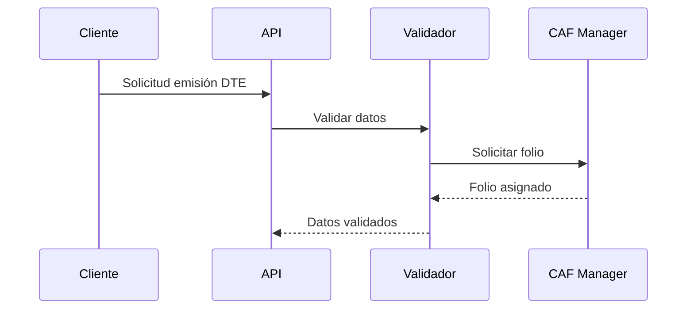
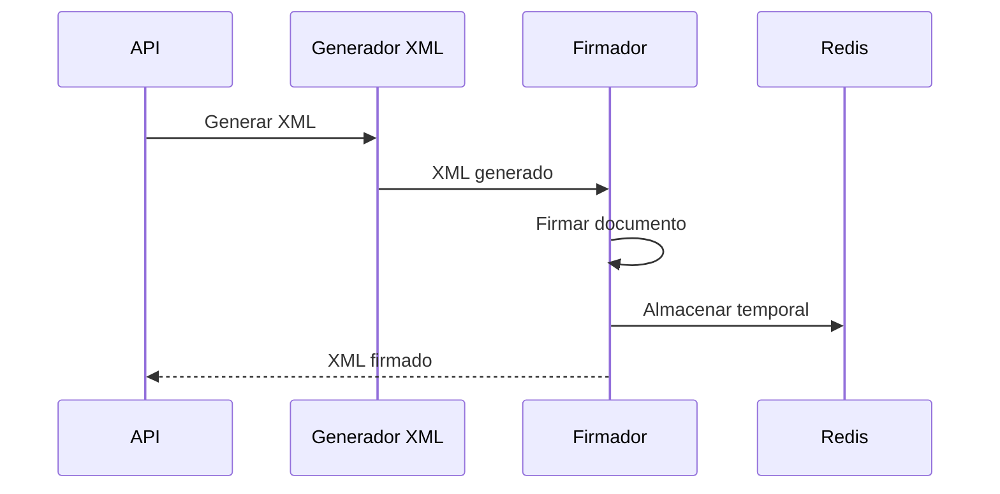
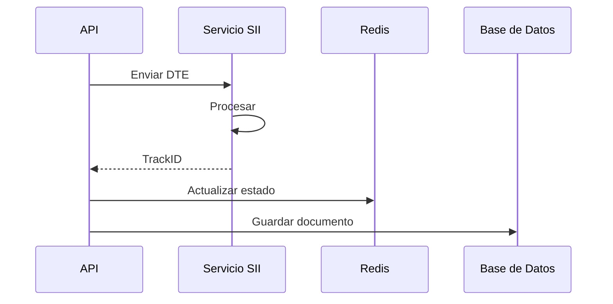

# Flujo de Documentos Tributarios Electrónicos (DTE)

## Descripción General
El flujo de DTE es el proceso core del sistema, que permite la emisión, validación y envío de documentos tributarios electrónicos al SII.

## Componentes Involucrados

### 1. Módulo DTE
- Generación de XML
- Validación de estructura
- Firma electrónica
- Manejo de CAF

### 2. Servicio SII
- Autenticación
- Envío de documentos
- Consulta de estado
- Manejo de respuestas

### 3. Caché Redis
- Almacenamiento temporal
- Consulta rápida
- Control de estado

## Flujo Detallado

### 1. Preparación

### 2. Generación y Firma

### 3. Envío al SII

## Estados del Documento

1. **PENDIENTE**
   - Documento creado
   - Pendiente de procesamiento

2. **XML_GENERADO**
   - XML generado correctamente
   - Pendiente de firma

3. **FIRMADO**
   - Documento firmado
   - Listo para envío

4. **ENVIADO_SII**
   - Documento enviado al SII
   - Esperando respuesta

5. **ACEPTADO**
   - Documento aceptado por SII
   - Proceso completado

6. **RECHAZADO**
   - Documento rechazado
   - Requiere corrección

## Validaciones

### Datos de Entrada
- RUT emisor y receptor válidos
- Montos y cálculos correctos
- Fechas válidas
- Referencias (si aplica)

### XML
- Esquema XSD válido
- Datos obligatorios
- Formato correcto

### Firma
- Certificado vigente
- Firma válida
- Timestamp correcto

## Manejo de Errores

### 1. Errores de Validación
- Datos incorrectos
- Esquema inválido
- CAF no disponible

### 2. Errores de Firma
- Certificado expirado
- Error en firma
- Problemas de timestamp

### 3. Errores de SII
- Timeout
- Rechazo
- Servicio no disponible

## Métricas

### Performance
- Tiempo de generación XML: < 100ms
- Tiempo de firma: < 200ms
- Tiempo total: < 500ms

### Disponibilidad
- Servicio: 99.9%
- Caché: 99.99%
- Base de datos: 99.99%

## Pruebas

### Unitarias
- Validación de datos
- Generación de XML
- Cálculos tributarios

### Integración
- Flujo completo
- Casos borde
- Recuperación de errores

### Carga
- 100 DTE/segundo
- Latencia < 200ms
- Error rate < 0.1% 