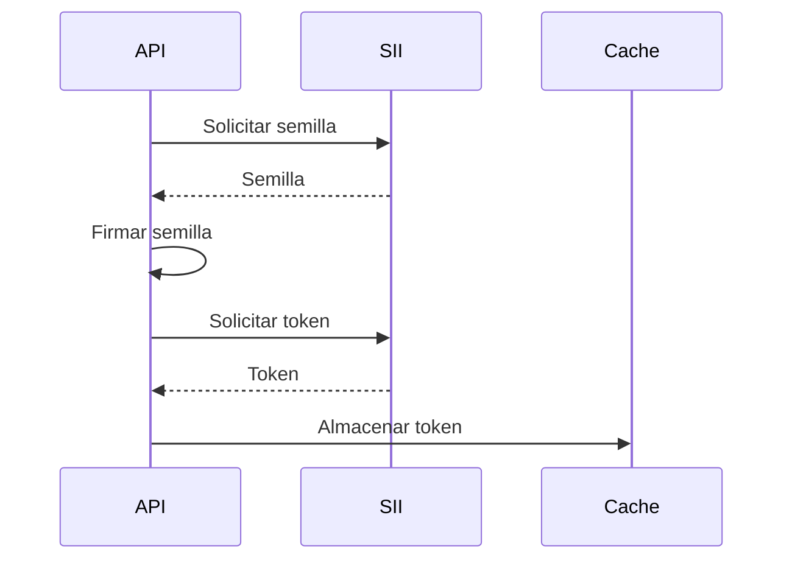
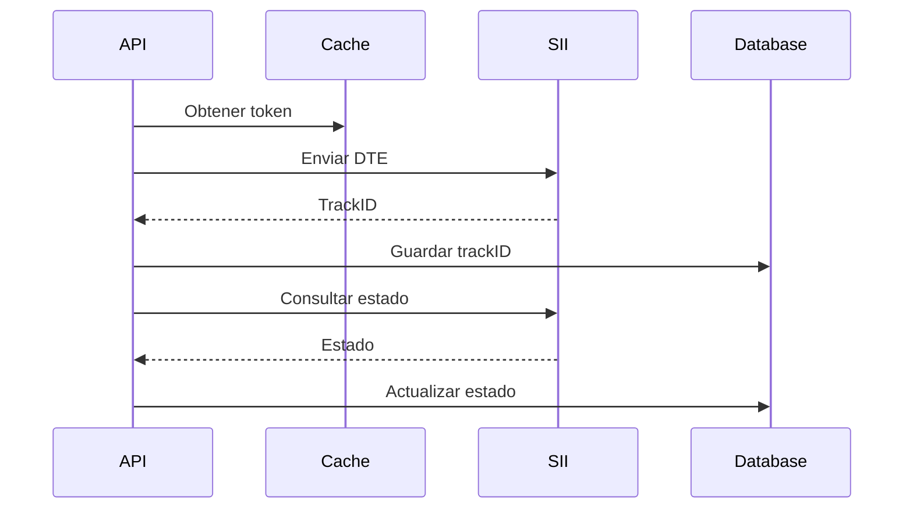
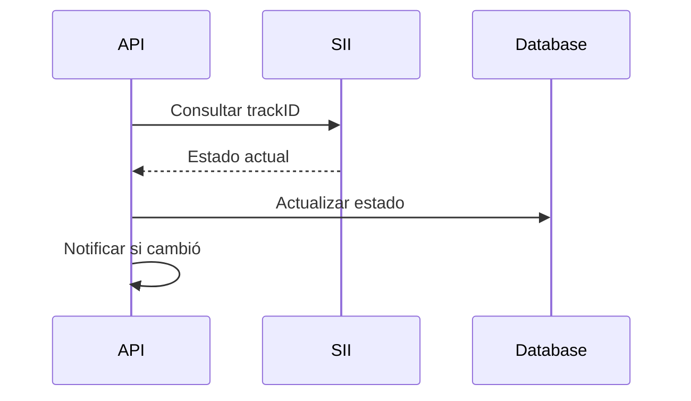

# Integración con SII

## Descripción General
La integración con el SII (Servicio de Impuestos Internos) es un componente crítico que maneja la comunicación con los servicios web del SII para el envío y consulta de documentos tributarios electrónicos.

## Componentes

### 1. Cliente HTTP
- Configuración TLS
- Manejo de certificados
- Timeouts y reintentos
- Pooling de conexiones

### 2. Autenticación
- Certificado digital
- Semilla y token
- Renovación automática
- Manejo de sesiones

### 3. Servicios
- Envío de documentos
- Consulta de estado
- Validación de CAF
- Libro de ventas/compras

## Flujos Principales

### 1. Autenticación

### 2. Envío de Documentos

### 3. Consulta de Estado

## Endpoints SII

### Producción
- Autenticación: `https://palena.sii.cl/DTEWS/GetTokenFromSeed.jws`
- Envío DTE: `https://palena.sii.cl/DTEWS/EnvioDTE.jws`
- Consulta: `https://palena.sii.cl/DTEWS/QueryEstDte.jws`

### Certificación
- Autenticación: `https://maullin.sii.cl/DTEWS/GetTokenFromSeed.jws`
- Envío DTE: `https://maullin.sii.cl/DTEWS/EnvioDTE.jws`
- Consulta: `https://maullin.sii.cl/DTEWS/QueryEstDte.jws`

## Manejo de Errores

### 1. Errores de Conexión
- Timeout
- DNS
- TLS/SSL
- Reintentos automáticos

### 2. Errores de Autenticación
- Certificado inválido
- Token expirado
- Semilla inválida
- Permisos insuficientes

### 3. Errores de Negocio
- Esquema inválido
- CAF no autorizado
- Firma incorrecta
- Datos inconsistentes

## Estrategias de Resiliencia

### 1. Circuit Breaker
- Umbral de errores: 5
- Tiempo de reset: 60s
- Monitoreo de estado

### 2. Retry Policy
- Máximo intentos: 3
- Backoff: exponencial
- Jitter: aleatorio

### 3. Fallback
- Cache local
- Modo offline
- Cola de reintentos

## Monitoreo

### Métricas
- Latencia de requests
- Tasa de error
- Uso de tokens
- Estado del circuito

### Logs
- Errores de conexión
- Respuestas SII
- Cambios de estado
- Renovación de tokens

### Alertas
- Circuit breaker abierto
- Error rate > 5%
- Latencia > 2s
- Token próximo a expirar

## Pruebas

### Unitarias
- Parseo de respuestas
- Manejo de errores
- Validaciones

### Integración
- Flujo completo
- Casos de error
- Timeouts

### Certificación
- Ambiente de pruebas SII
- Set de casos SII
- Documentación oficial

## Seguridad

### Certificados
- Almacenamiento seguro
- Rotación automática
- Monitoreo de expiración

### Tokens
- Encriptación en reposo
- TTL configurado
- Renovación anticipada

### Datos
- TLS 1.2+
- Validación de respuestas
- Sanitización de inputs 