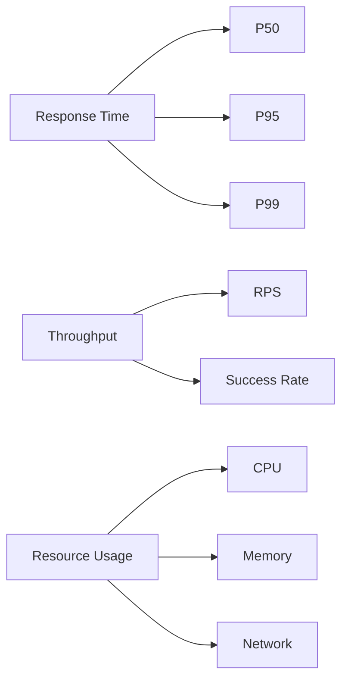
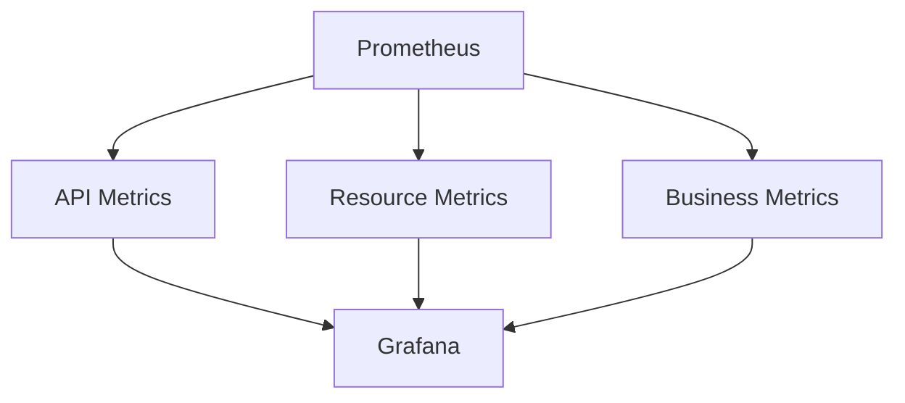

# Métricas y Rendimiento - FMgo MVP

## Objetivos de Rendimiento

### 1. Latencia
- API Response Time: < 200ms (P95)
- Cache Access: < 50ms (P99)
- Database Queries: < 100ms (P95)
- XML Generation: < 100ms
- DTE Signing: < 200ms

### 2. Throughput
- API: 1000 RPS
- Cache: 5000 RPS
- Database: 2000 RPS
- DTE Processing: 100 DTE/s

### 3. Disponibilidad
- API: 99.9%
- Cache: 99.99%
- Database: 99.99%
- SII Integration: 99.5%

## Métricas Clave (KPIs)

### 1. Rendimiento

#### Métricas Base
- Request/segundo
- Latencia por endpoint
- Error rate
- CPU usage
- Memory usage
- Network I/O

#### Métricas de Negocio
- DTEs procesados/hora
- Tasa de aceptación SII
- Tiempo total de proceso
- Cache hit rate

### 2. Recursos

#### CPU
- Uso promedio: < 70%
- Pico máximo: < 90%
- Throttling: 0%

#### Memoria
- Uso base: < 2GB
- Heap size: < 4GB
- GC pause: < 100ms

#### Red
- Bandwidth: < 100Mbps
- Conexiones: < 10000
- Timeout rate: < 0.1%

## Monitoreo

### 1. Dashboards

#### Paneles Principales
1. **API Health**
   - Response time
   - Error rate
   - Request rate
   - Status codes

2. **Resources**
   - CPU/Memory
   - Network I/O
   - Disk usage
   - Connection pool

3. **Business**
   - DTE flow
   - SII status
   - Cache efficiency
   - Error distribution

### 2. Alerting

#### Críticas
- API error rate > 1%
- Response time > 500ms
- CPU > 90%
- Memory > 90%
- Cache miss > 20%

#### Warnings
- API error rate > 0.5%
- Response time > 300ms
- CPU > 80%
- Memory > 80%
- Cache miss > 10%

## Pruebas de Carga

### 1. Escenarios

#### Normal Load
- 100 RPS constante
- Mix de operaciones
- 24 horas duración

#### Peak Load
- 500 RPS pico
- 10 minutos duración
- Recovery monitoring

#### Stress Test
- 1000 RPS
- Hasta degradación
- Límites del sistema

### 2. Herramientas
- k6 para pruebas
- Grafana para visualización
- Prometheus para métricas
- Custom scripts para análisis

## Optimizaciones

### 1. Caché
- Política de expiración
- Warm-up strategy
- Cache hierarchy
- Distributed caching

### 2. Database
- Connection pooling
- Query optimization
- Index strategy
- Partitioning

### 3. Application
- Thread pooling
- Async processing
- Batch operations
- Resource pooling

## Capacity Planning

### 1. Recursos Base
- 4 CPU cores
- 8GB RAM
- 100GB SSD
- 1Gbps Network

### 2. Escalamiento
- Horizontal: +2 nodes
- Vertical: +2 cores
- Memory: +4GB/node
- Storage: +50GB/month

### 3. Límites
- Max nodes: 10
- Max CPU: 40 cores
- Max RAM: 80GB
- Max Storage: 1TB

## Recovery

### 1. Backup
- Full: Daily
- Incremental: Hourly
- Retention: 30 days
- Recovery time: < 1h

### 2. Failover
- Detection: < 10s
- Switching: < 30s
- Recovery: < 5min
- Data loss: 0

### 3. Degradation
- Graceful degradation
- Feature toggles
- Circuit breakers
- Fallback modes 