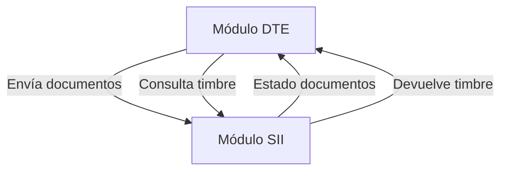
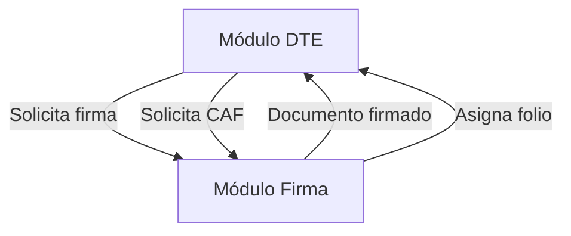
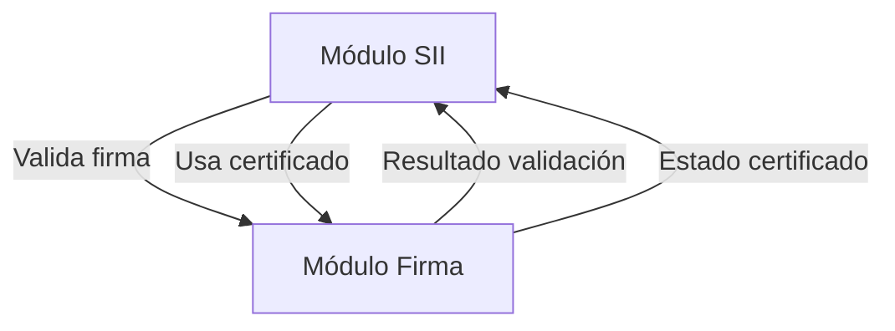
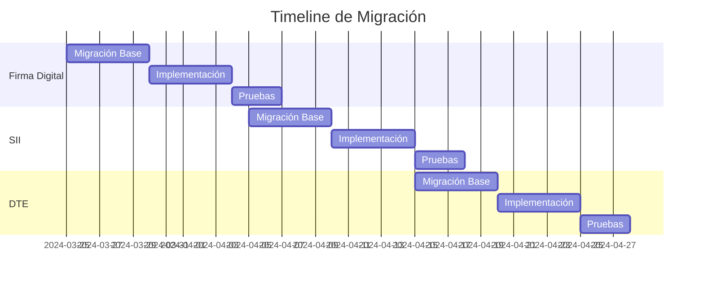

# Análisis de Dependencias y Mejoras

## 1. Dependencias entre Módulos Core

### DTE ↔ SII


**Propuestas de Mejora:**
1. Crear interfaces de comunicación claras entre DTE y SII
2. Implementar sistema de colas para comunicación asíncrona
3. Definir DTOs específicos para la comunicación
4. Establecer manejo de errores común

### Firma Digital ↔ DTE


**Propuestas de Mejora:**
1. Separar gestión de CAF de la firma digital
2. Implementar sistema de pre-asignación de folios
3. Crear cache de certificados frecuentes
4. Establecer política de renovación de CAF

### SII ↔ Firma Digital


**Propuestas de Mejora:**
1. Centralizar gestión de certificados
2. Implementar validación previa de certificados
3. Crear sistema de alertas compartido
4. Establecer política de caché común

## 2. Mejoras Propuestas para los Planes Actuales

### Plan SII
1. **Manejo de Errores**
   - Implementar catálogo de errores SII
   - Crear sistema de reintentos inteligente
   - Definir políticas de timeout específicas
   - Implementar circuit breaker

2. **Sistema de Reintentos**
   - Definir política de reintentos por tipo de error
   - Implementar backoff exponencial
   - Crear sistema de notificaciones de reintentos
   - Establecer límites de reintentos

3. **Integración con DTE**
   - Crear interfaces específicas para DTE
   - Implementar validaciones previas
   - Establecer sistema de tracking
   - Definir formato de respuestas

### Plan Firma Digital
1. **Gestión de CAF**
   - Implementar sistema de respaldo automático
   - Crear política de renovación proactiva
   - Establecer umbrales de alerta
   - Definir proceso de recuperación

2. **Migración de Datos**
   - Crear plan de migración de CAFs existentes
   - Establecer validación de integridad
   - Definir proceso de rollback
   - Implementar verificación post-migración

3. **Seguridad Mejorada**
   - Implementar HSM para claves críticas
   - Crear sistema de auditoría detallado
   - Establecer políticas de rotación
   - Definir niveles de acceso

## 3. Plan de Contingencia Durante Migración

### Fase 1: Preparación
1. **Respaldo de Datos**
   - Crear snapshots de bases de datos
   - Respaldar certificados y CAFs
   - Documentar configuración actual
   - Verificar integridad de respaldos

2. **Ambiente de Pruebas**
   - Crear ambiente espejo
   - Validar funcionalidad completa
   - Realizar pruebas de carga
   - Verificar tiempos de respuesta

### Fase 2: Migración
1. **Orden de Migración**
   ```mermaid
   graph TD
       A[Firma Digital] -->|1| B[SII]
       B -->|2| C[DTE]
       C -->|3| D[Componentes Auxiliares]
   ```

2. **Puntos de Control**
   - Validación de firmas
   - Verificación de folios
   - Comprobación de comunicación SII
   - Testing de integración

### Fase 3: Rollback
1. **Triggers de Rollback**
   - Errores en firma digital
   - Fallos en comunicación SII
   - Problemas de performance
   - Inconsistencias de datos

2. **Procedimiento**
   - Restaurar desde snapshot
   - Verificar integridad
   - Validar funcionalidad
   - Notificar stakeholders

## 4. Métricas de Éxito

### Performance
- Tiempo de respuesta < 500ms
- Latencia de firma < 100ms
- Éxito en comunicación SII > 99%
- Disponibilidad de CAF > 99.9%

### Calidad
- Cobertura de pruebas > 80%
- Duplicación de código < 5%
- Dependencias circulares = 0
- Deuda técnica reducida en 50%

## 5. Timeline Propuesto

