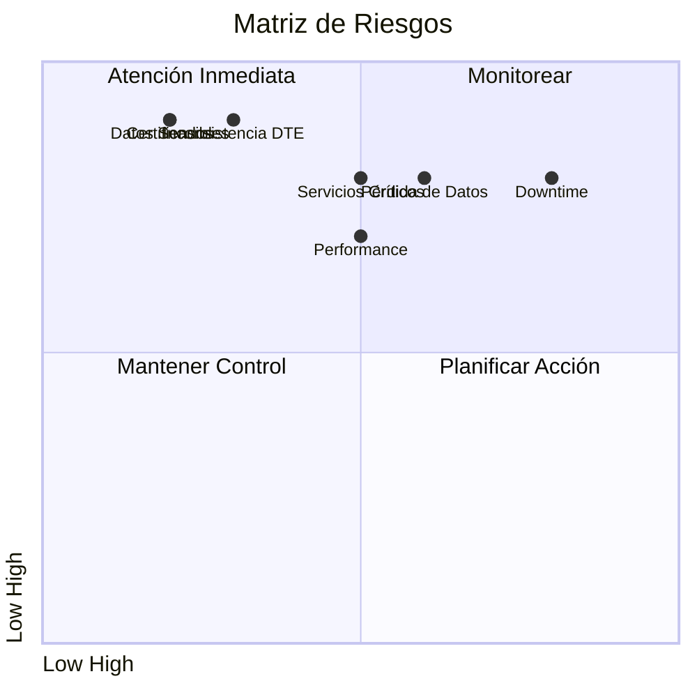
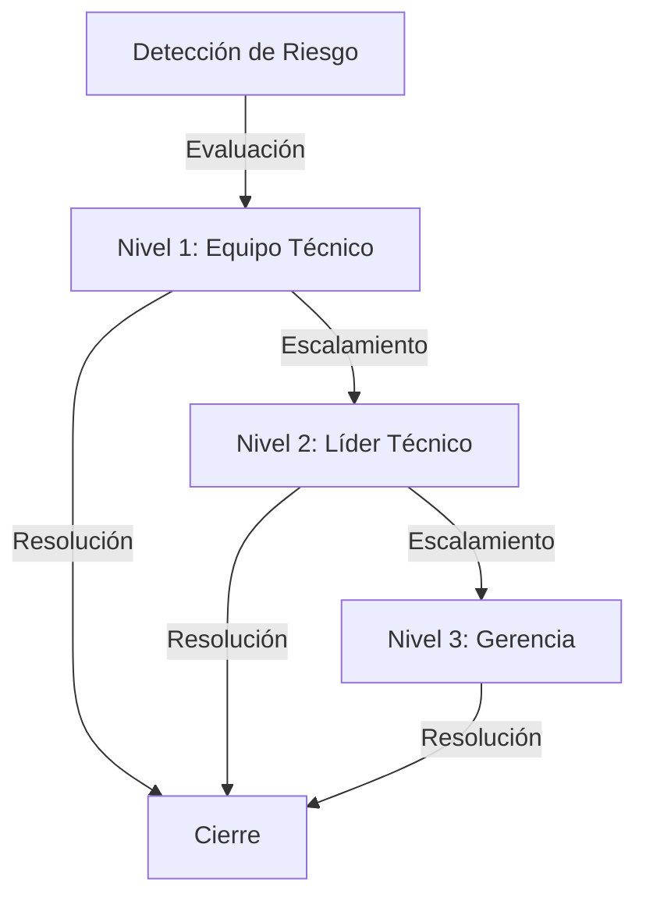
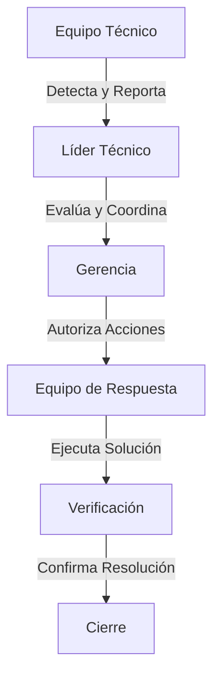

# Análisis de Riesgos y Estrategias de Mitigación

## 1. Riesgos Técnicos

### 1.1 Pérdida de Datos
**Probabilidad:** Media  
**Impacto:** Alto  
**Nivel de Riesgo:** Alto

**Estrategias de Mitigación:**
1. Implementar sistema de respaldo continuo
2. Crear snapshots antes de cada migración
3. Validar integridad de datos post-migración
4. Mantener logs detallados de cambios

### 1.2 Downtime Durante Migración
**Probabilidad:** Alta  
**Impacto:** Alto  
**Nivel de Riesgo:** Alto

**Estrategias de Mitigación:**
1. Implementar migración gradual
2. Realizar migraciones en ventanas de mantenimiento
3. Tener plan de rollback rápido
4. Mantener sistema paralelo durante transición

### 1.3 Problemas de Performance
**Probabilidad:** Media  
**Impacto:** Alto  
**Nivel de Riesgo:** Alto

**Estrategias de Mitigación:**
1. Realizar pruebas de carga previas
2. Implementar monitoreo detallado
3. Optimizar queries y operaciones críticas
4. Establecer benchmarks de performance

## 2. Riesgos de Negocio

### 2.1 Interrupción de Servicios Críticos
**Probabilidad:** Media  
**Impacto:** Alto  
**Nivel de Riesgo:** Alto

**Estrategias de Mitigación:**
1. Identificar servicios críticos
2. Implementar redundancia
3. Establecer SLAs claros
4. Tener plan de contingencia

### 2.2 Inconsistencia en Documentos Tributarios
**Probabilidad:** Baja  
**Impacto:** Crítico  
**Nivel de Riesgo:** Alto

**Estrategias de Mitigación:**
1. Implementar validaciones exhaustivas
2. Mantener trazabilidad completa
3. Realizar auditorías periódicas
4. Establecer proceso de reconciliación

## 3. Riesgos de Seguridad

### 3.1 Exposición de Datos Sensibles
**Probabilidad:** Baja  
**Impacto:** Crítico  
**Nivel de Riesgo:** Alto

**Estrategias de Mitigación:**
1. Implementar encriptación end-to-end
2. Realizar auditorías de seguridad
3. Establecer controles de acceso
4. Mantener logs de seguridad

### 3.2 Compromiso de Certificados
**Probabilidad:** Baja  
**Impacto:** Crítico  
**Nivel de Riesgo:** Alto

**Estrategias de Mitigación:**
1. Implementar HSM
2. Establecer política de rotación
3. Mantener respaldos seguros
4. Monitorear uso de certificados

## 4. Matriz de Riesgos

## 5. Plan de Monitoreo de Riesgos

### 5.1 Indicadores Clave
1. **Técnicos**
   - Tiempo de respuesta
   - Tasa de errores
   - Uso de recursos
   - Integridad de datos

2. **Negocio**
   - Disponibilidad de servicios
   - Tasa de éxito DTE
   - Satisfacción de usuarios
   - Cumplimiento de SLA

3. **Seguridad**
   - Intentos de acceso no autorizado
   - Integridad de certificados
   - Eventos de seguridad
   - Cumplimiento normativo

### 5.2 Procedimientos de Escalamiento

## 6. Plan de Respuesta a Incidentes

### 6.1 Procedimiento General
1. **Detección y Reporte**
   - Identificar incidente
   - Clasificar severidad
   - Notificar responsables
   - Iniciar registro

2. **Contención**
   - Aislar problema
   - Prevenir propagación
   - Proteger datos
   - Mantener evidencia

3. **Resolución**
   - Implementar solución
   - Verificar efectividad
   - Documentar acciones
   - Actualizar sistemas

4. **Post-Mortem**
   - Analizar causa raíz
   - Documentar lecciones
   - Actualizar procesos
   - Implementar mejoras

### 6.2 Roles y Responsabilidades

## 7. Mejora Continua

### 7.1 Proceso de Revisión
- Revisiones mensuales de riesgos
- Actualización de estrategias
- Evaluación de efectividad
- Ajuste de controles

### 7.2 Métricas de Efectividad
- Tiempo de detección
- Tiempo de respuesta
- Tasa de recurrencia
- Efectividad de controles 