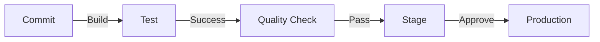

# Fase 1: Preparación del Ambiente

## 1. Configuración de Ambientes

### 1.1 Ambiente de Desarrollo
```bash
# Estructura de directorios base
dev/
├── firma/
├── sii/
├── dte/
├── config/
└── scripts/
```

#### Tareas Inmediatas
- [ ] Crear estructura de directorios base
- [ ] Configurar variables de entorno
- [ ] Establecer permisos y accesos
- [ ] Configurar herramientas de desarrollo

### 1.2 Ambiente de Pruebas
```bash
# Estructura de directorios base
test/
├── firma/
├── sii/
├── dte/
├── config/
└── test_data/
```

#### Tareas Inmediatas
- [ ] Replicar estructura de desarrollo
- [ ] Configurar datos de prueba
- [ ] Establecer pipeline de CI/CD
- [ ] Configurar herramientas de testing

## 2. Preparación de Base de Datos

### 2.1 Respaldo y Documentación
- [ ] Crear snapshot de base de datos actual
- [ ] Documentar esquema actual
- [ ] Identificar datos críticos
- [ ] Establecer política de respaldos

### 2.2 Migración de Esquema
```sql
-- Ejemplo de nueva estructura
CREATE SCHEMA core;
CREATE SCHEMA audit;
CREATE SCHEMA metrics;
CREATE SCHEMA config;
```

#### Plan de Migración
1. **Fase de Preparación**
   - Documentar esquema actual
   - Diseñar nuevo esquema
   - Crear scripts de migración
   - Validar integridad de datos

2. **Fase de Prueba**
   - Ejecutar migración en ambiente de prueba
   - Verificar integridad
   - Validar performance
   - Documentar resultados

3. **Fase de Rollback**
   - Crear snapshots pre-migración
   - Preparar scripts de rollback
   - Documentar procedimientos
   - Validar proceso

## 3. Configuración de CI/CD

### 3.1 Pipeline Base


### 3.2 Tareas de Configuración
- [ ] Configurar GitHub Actions/Jenkins
- [ ] Establecer ambientes
- [ ] Configurar secretos
- [ ] Implementar tests automatizados

## 4. Herramientas y Dependencias

### 4.1 Gestión de Dependencias
```go
// go.mod ejemplo
module github.com/fmgo

go 1.21

require (
    github.com/gin-gonic/gin v1.9.1
    github.com/go-redis/redis/v8 v8.11.5
    github.com/prometheus/client_golang v1.11.1
)
```

### 4.2 Herramientas de Desarrollo
- [ ] Configurar linters
- [ ] Establecer formatters
- [ ] Implementar pre-commit hooks
- [ ] Configurar debuggers

## 5. Scripts de Automatización

### 5.1 Scripts de Desarrollo
```bash
scripts/
├── setup.sh
├── test.sh
├── build.sh
└── deploy.sh
```

### 5.2 Scripts de Base de Datos
```bash
db/
├── migrations/
├── backup/
├── restore/
└── validate/
```

## 6. Documentación Inicial

### 6.1 Documentación Técnica
- [ ] Arquitectura del sistema
- [ ] Guías de desarrollo
- [ ] Procedimientos de CI/CD
- [ ] Estándares de código

### 6.2 Documentación de Procesos
- [ ] Procedimientos de desarrollo
- [ ] Guías de testing
- [ ] Procesos de deployment
- [ ] Procedimientos de emergencia

## 7. Plan de Verificación

### 7.1 Checklist de Preparación
- [ ] Ambientes configurados
- [ ] Base de datos preparada
- [ ] CI/CD funcionando
- [ ] Documentación inicial completa

### 7.2 Criterios de Éxito
1. **Ambiente de Desarrollo**
   - Todos los desarrolladores pueden trabajar localmente
   - Tests corren correctamente
   - Herramientas configuradas
   - Documentación accesible

2. **Ambiente de Pruebas**
   - Pipeline de CI/CD funcional
   - Tests automatizados ejecutándose
   - Datos de prueba disponibles
   - Monitoreo configurado

3. **Base de Datos**
   - Respaldos configurados
   - Scripts de migración probados
   - Rollback verificado
   - Performance validada

## 8. Siguiente Fase

### 8.1 Criterios para Avanzar
- [ ] Todos los ambientes operativos
- [ ] CI/CD pipeline funcional
- [ ] Documentación completa
- [ ] Equipo capacitado

### 8.2 Planificación
- Revisar plan de módulo Firma Digital
- Preparar sprints iniciales
- Asignar recursos
- Establecer métricas de seguimiento 