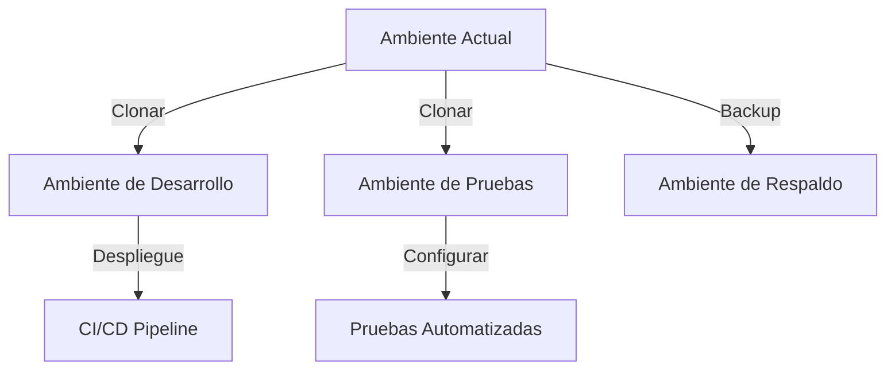
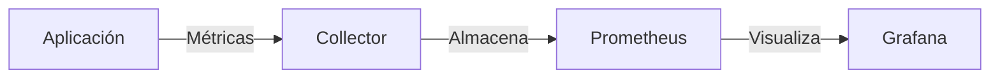
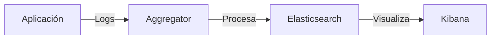
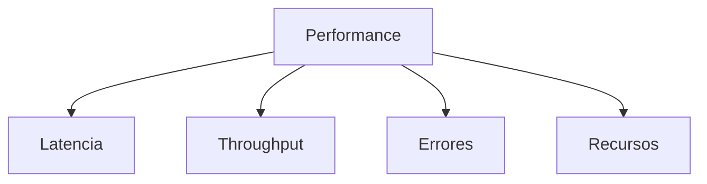
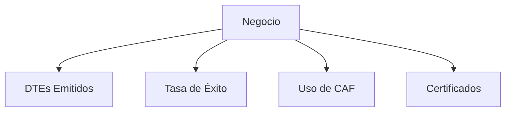

# Plan de Implementación - FMgo

## 1. Fase Inicial: Preparación del Ambiente

### 1.1 Infraestructura de Desarrollo

### 1.2 Preparación de Base de Datos
1. **Respaldo Inicial**
   - Snapshot completo de bases actuales
   - Exportación de datos críticos
   - Documentación de esquemas
   - Verificación de integridad

2. **Ambiente de Desarrollo**
   - Crear bases de datos espejo
   - Implementar sincronización
   - Configurar accesos seguros
   - Establecer políticas de backup

## 2. Fase de Implementación Core

### 2.1 Módulo Firma Digital y CAF (Semanas 1-3)

#### Semana 1: Estructura Base
- [ ] Crear estructura de directorios
- [ ] Migrar modelos base
- [ ] Implementar interfaces core
- [ ] Configurar tests unitarios

#### Semana 2: Servicios Principales
- [ ] Implementar FirmaService
- [ ] Desarrollar CAFService
- [ ] Crear sistema de almacenamiento
- [ ] Configurar caché

#### Semana 3: Integración y Pruebas
- [ ] Implementar API REST
- [ ] Desarrollar CLI de gestión
- [ ] Realizar pruebas de integración
- [ ] Documentar APIs

### 2.2 Módulo SII (Semanas 4-6)

#### Semana 4: Estructura Base
- [ ] Crear estructura de directorios
- [ ] Migrar cliente SII existente
- [ ] Implementar manejo de errores
- [ ] Configurar circuit breaker

#### Semana 5: Sistema de Comunicación
- [ ] Implementar cola de mensajes
- [ ] Desarrollar sistema de reintentos
- [ ] Crear gestión de sesiones
- [ ] Configurar timeouts

#### Semana 6: Integración y Pruebas
- [ ] Integrar con Firma Digital
- [ ] Implementar validaciones
- [ ] Realizar pruebas de carga
- [ ] Documentar interfaces

### 2.3 Módulo DTE (Semanas 7-9)

#### Semana 7: Estructura Base
- [ ] Crear estructura de directorios
- [ ] Migrar modelos DTE
- [ ] Implementar validaciones
- [ ] Configurar persistencia

#### Semana 8: Integración
- [ ] Integrar con SII
- [ ] Integrar con Firma Digital
- [ ] Implementar flujo completo
- [ ] Configurar monitoreo

#### Semana 9: Pruebas y Optimización
- [ ] Realizar pruebas end-to-end
- [ ] Optimizar performance
- [ ] Implementar caché
- [ ] Documentar sistema

## 3. Fase de Componentes Auxiliares

### 3.1 Sistema de Métricas (Semana 10)

- [ ] Implementar collectors
- [ ] Configurar Prometheus
- [ ] Crear dashboards Grafana
- [ ] Establecer alertas

### 3.2 Sistema de Logging (Semana 11)

- [ ] Implementar logging estructurado
- [ ] Configurar agregación
- [ ] Crear índices y visualizaciones
- [ ] Establecer retención

## 4. Plan de Verificación

### 4.1 Pruebas Unitarias
- Cobertura mínima: 80%
- Pruebas de casos borde
- Validación de errores
- Mocking de dependencias

### 4.2 Pruebas de Integración
- Flujos completos
- Escenarios de error
- Performance testing
- Pruebas de resiliencia

### 4.3 Pruebas de Aceptación
- Validación funcional
- Verificación de requerimientos
- Testing de usabilidad
- Pruebas de seguridad

## 5. Monitoreo y Métricas

### 5.1 Métricas Operacionales

### 5.2 Métricas de Negocio

## 6. Plan de Rollback

### 6.1 Triggers de Rollback
- Errores críticos en producción
- Problemas de performance severos
- Inconsistencia de datos
- Fallos de seguridad

### 6.2 Procedimiento
1. **Detener Servicios**
   - Pausar procesamiento
   - Notificar usuarios
   - Registrar estado

2. **Restaurar Estado**
   - Aplicar snapshot
   - Verificar integridad
   - Validar configuración

3. **Verificar y Reanudar**
   - Probar funcionalidad
   - Verificar datos
   - Reanudar servicios
   - Notificar resolución

## 7. Documentación

### 7.1 Documentación Técnica
- Arquitectura del sistema
- Diagramas de secuencia
- APIs y contratos
- Procedimientos operativos

### 7.2 Documentación de Usuario
- Guías de usuario
- Procedimientos comunes
- Troubleshooting
- FAQs

## 8. Entregables por Fase

### Fase 1: Preparación
- [x] Plan de trabajo detallado
- [x] Análisis de dependencias
- [ ] Ambiente de desarrollo
- [ ] Scripts de migración

### Fase 2: Implementación Core
- [ ] Módulo Firma Digital
- [ ] Módulo SII
- [ ] Módulo DTE
- [ ] Pruebas integradas

### Fase 3: Componentes Auxiliares
- [ ] Sistema de métricas
- [ ] Sistema de logging
- [ ] Documentación
- [ ] Monitoreo 